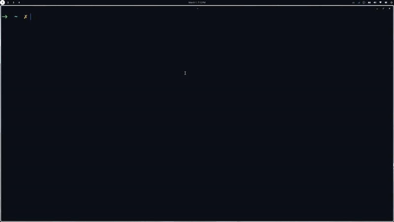

# kitty-sessionizer
Custom kitten that helps you manage workspaces by offering a simple TUI project selector and local session resurrection (only tabs and very simple pane layouts for now).

## Demo


## Installation
Ensure you have [fzf](https://github.com/junegunn/fzf) installed for the TUI.

Then clone the repo into your kitty configuration directory (assuming `~/config/kitty/` here, adjust if necessary):
```
git clone https://github.com/DavidRamosSal/kitty-sessionizer.git ~/.config/kitty/sessionizer
```

## Set up
Create a shortcut in your configuration file to launch the project selector TUI and set the path to the directory where your projects are (only one source is handled for now, assuming `$HOME/projects/` here, be sure to adjust to your case):
```
# ~/.config/kitty/kitty.conf

map ctrl+k kitten sessionizer/sessionizer.py --project_dir $HOME/projects
```

Finally add the global watcher to your configuration file (this is necessary to keep track of the terminal layout)

```
# ~/.config/kitty/kitty.conf

watcher sessionizer/watcher.py
```

**Note:** A json file contaning a serialized version of the OS Window state will be stored at the kitty configuration folder (eg. `.config/kitty/state.json`)

## Limitations
- It only works locally.
- Window start might be a bit slower due to the watcher script.
- Window size is not restored.
- Complex layouts (anything more than some tabs and panes without bias) will not be reproduced accurately.
- Last focus is saved but not being restored as of now (might implement soon) 
- Last command executed is saved but not restored (might be doable but I'm having some trouble making it work consistently)
- Scroll history is not being saved (might try to implement)

